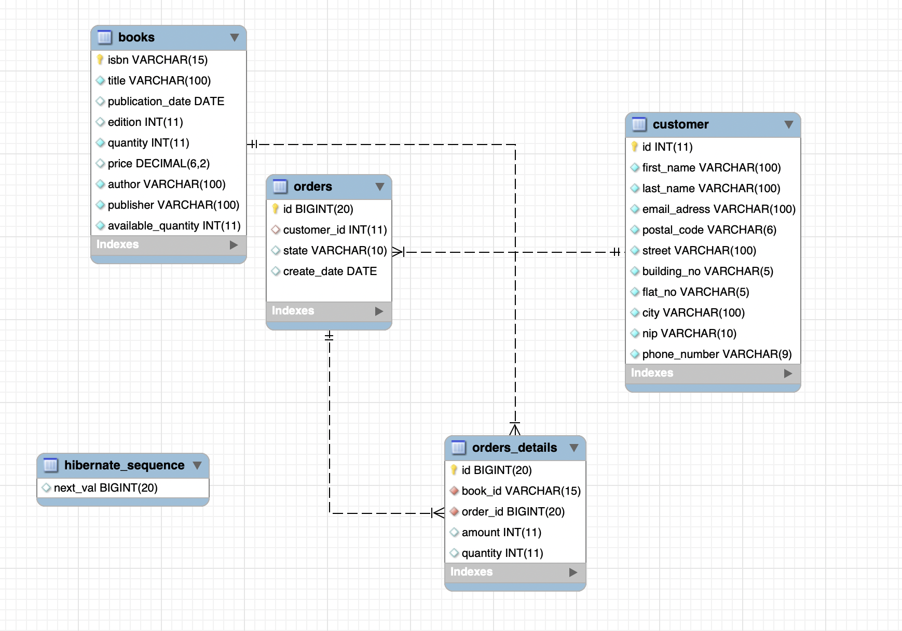

# ReadingIsGood

## About the Microservice
ReadingIsGood is an online books retail firm which operates only on the Internet. Main target of ReadingIsGood is to deliver books from its one centralized warehouse to their customers within the same day. That is why stock consistency is the first priority for their vision operations.
### Architecture of Service
ReadingIsGood service has a layered structure in itself. On the side designated as the data layer, DAO classes are defined with POJO objects. For the service layer, in the interfaces included in the repository package, the properties of the spring framework are used for the database interaction of the methods belonging to the properties of the classes. These interfaces are implemented in the services package according to their own classes. In the API layer, the classes included in this service package are extended and the methods are implemented and the rest api is provided with the spring framework.
Besides mysql is used as database. Database desing is as below.




## Getting Started

### Prerequisites
* The microservice runs with Java 11. 
* Database tables should create with tableCreateScripts file.

### Installation

* JAVA11 SDK must be installed.
* IDE must be installed for Java development.
* MysqlDB 

### Configurations
#### Application Configurations

Service using Spring's default locale configurations.
* `server.port:8080`
*  Active profile should be 'local'.

#### Database Configurations

Service using default database configurations for mysql

## Usage

### Api
```
Swagger url: http://localhost:8080/swagger-ui.html#/
```
**createBook*
* `Request`
```
POST
/books/create
```
* Request Body
```
{
  "author": "duygu",
  "edition": 0,
  "isbn": "12345679",
  "price": 125.00,
  "publicationDate": "2021-08-26T08:59:56.728Z",
  "publisher": "Can",
  "quantity": 5,
  "title": "denemeKitap2"
}
```

* `Response`

```json
{
  "isbn": "12345679",
  "title": "denemeKitap2",
  "publicationDate": 1629968396728,
  "edition": 0,
  "price": 125,
  "author": "duygu",
  "publisher": "Can",
  "availableQuantity": 5,
  "quantity": 5
}
```
**updateBook**
* `Request`
```
PUT
/books/update
```
* Request Body

```
{
  "isbn": "12345679",
  "title": "denemeKitap2",
  "publicationDate": 1629968396728,
  "edition": 0,
  "price": 125,
  "author": "duygu",
  "publisher": "Can",
  "availableQuantity": 5,
  "quantity": 5
}
```

* `Response`

```json
{
  "isbn": "12345679",
  "title": "denemeKitap2",
  "publicationDate": 1629968396728,
  "edition": 0,
  "price": 125,
  "author": "duygu",
  "publisher": "Can",
  "availableQuantity": 5,
  "quantity": 5
}
```


**createCustomer**
* `Request`
```
POST
/customer/create
```
* Request Body
```
{
  "buildingNo": "string",
  "city": "string",
  "emailAdress": "string",
  "firstName": "string",
  "flatNo": "string",
  "lastName": "string",
  "nip": "string",
  "phoneNumber": "string",
  "postalCode": "string",
  "street": "string"
}
```
```
* `Response`
  {
  "buildingNo": "string",
  "city": "string",
  "emailAdress": "string",
  "firstName": "string",
  "flatNo": "string",
  "lastName": "string",
  "nip": "string",
  "phoneNumber": "string",
  "postalCode": "string",
  "street": "string"
  }
  ```


**getOrdersOfCutomer**
* `Request`
```
GET
/customer/{customerNo}/orders
```

```json
parameter:
customerNo
```

* `Response`

```json
[
  {
    "createDate": "2021-08-26T09:25:53.440Z",
    "customer": {
      "buildingNo": "string",
      "city": "string",
      "emailAdress": "string",
      "firstName": "string",
      "flatNo": "string",
      "id": 0,
      "lastName": "string",
      "nip": "string",
      "phoneNumber": "string",
      "postalCode": "string",
      "street": "string"
    },
    "id": 0,
    "orderDetails": [
      {
        "amount": 0,
        "book": {
          "author": "string",
          "availableQuantity": 0,
          "edition": 0,
          "isbn": "string",
          "price": 0,
          "publicationDate": "2021-08-26T09:25:53.440Z",
          "publisher": "string",
          "quantity": 0,
          "title": "string"
        },
        "id": 0,
        "quantity": 0
      }
    ],
    "state": "string"
  }
]
```

**getOrdersById**
* `Request`
```
GET
/orders/by-customer-id
```

```json
parameter:
customerId
```

* `Response`

```json
[
  {
    "createDate": "2021-08-26T09:28:12.213Z",
    "customer": {
      "buildingNo": "string",
      "city": "string",
      "emailAdress": "string",
      "firstName": "string",
      "flatNo": "string",
      "id": 0,
      "lastName": "string",
      "nip": "string",
      "phoneNumber": "string",
      "postalCode": "string",
      "street": "string"
    },
    "id": 0,
    "orderDetails": [
      {
        "amount": 0,
        "book": {
          "author": "string",
          "availableQuantity": 0,
          "edition": 0,
          "isbn": "string",
          "price": 0,
          "publicationDate": "2021-08-26T09:28:12.213Z",
          "publisher": "string",
          "quantity": 0,
          "title": "string"
        },
        "id": 0,
        "quantity": 0
      }
    ],
    "state": "string"
  }
]

```

**getOrdersByDateInerval**
* `Request`
```
GET
/orders/by-date-interval
```

```json
parameter:
startDate
EndDate
```

* `Response`

```json
[
  {
    "createDate": "2021-08-26T09:30:16.498Z",
    "customer": {
      "buildingNo": "string",
      "city": "string",
      "emailAdress": "string",
      "firstName": "string",
      "flatNo": "string",
      "id": 0,
      "lastName": "string",
      "nip": "string",
      "phoneNumber": "string",
      "postalCode": "string",
      "street": "string"
    },
    "id": 0,
    "orderDetails": [
      {
        "amount": 0,
        "book": {
          "author": "string",
          "availableQuantity": 0,
          "edition": 0,
          "isbn": "string",
          "price": 0,
          "publicationDate": "2021-08-26T09:30:16.498Z",
          "publisher": "string",
          "quantity": 0,
          "title": "string"
        },
        "id": 0,
        "quantity": 0
      }
    ],
    "state": "string"
  }
]
```

**createOrders**
* `Request`
```
POST
/orders/create
```

```json
{
  "customerId": 0,
  "orderDetailsRequest": [
    {
      "amount": 0,
      "bookId": "string",
      "quantity": 0
    }
  ],
  "state": "string"
}
```

* `Response`

```json
{
  "createDate": "2021-08-26T09:31:49.639Z",
  "customer": {
    "buildingNo": "string",
    "city": "string",
    "emailAdress": "string",
    "firstName": "string",
    "flatNo": "string",
    "id": 0,
    "lastName": "string",
    "nip": "string",
    "phoneNumber": "string",
    "postalCode": "string",
    "street": "string"
  },
  "id": 0,
  "orderDetails": [
    {
      "amount": 0,
      "book": {
        "author": "string",
        "availableQuantity": 0,
        "edition": 0,
        "isbn": "string",
        "price": 0,
        "publicationDate": "2021-08-26T09:31:49.639Z",
        "publisher": "string",
        "quantity": 0,
        "title": "string"
      },
      "id": 0,
      "quantity": 0
    }
  ],
  "state": "string"
}
```

**getStatisticValues**
* `Request`
```
GET
/statistics/{customerId}
```

```json
parameter:
customerId
```

* `Response`

```json
[
  {
    "month": "string",
    "totalBookCount": 0,
    "totalOrderCount": 0,
    "totalPurchasedAmount": 0
  }
]
```

